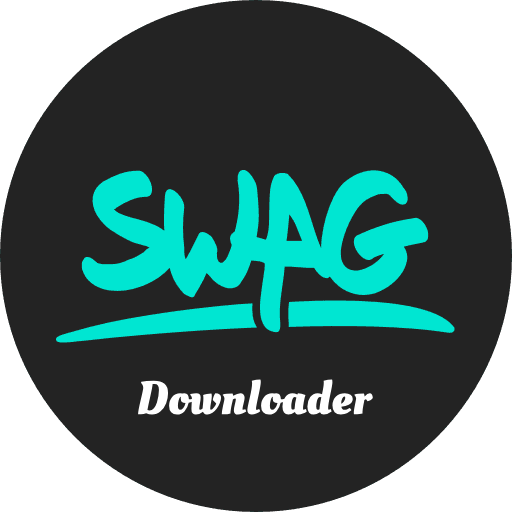
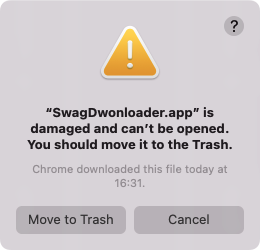
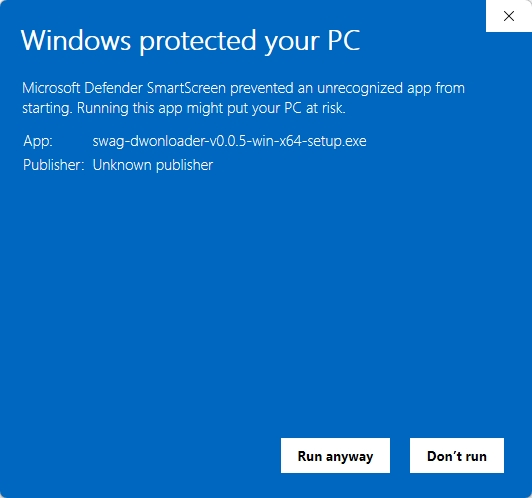

<div align="center">

</div>

# Swag.live Downloader

[](https://choosealicense.com/licenses/mit/) [](./zReadme/README-ZH-TW.md)

This is a video downloader for the [swag.live](https://swag.live) website. Please note that this project only allows you to download videos that you have already purchased on `swag`. For details, see: [swag.live archive](https://swag.live/archive?lang=en).

> **Note:** This project is intended for personal learning only. Please comply with all relevant agreements.

> Demo video: [Click here to view the online demo](https://www.dropbox.com/scl/fi/beb96ny2jmptsnq1n0y10/demo.mp4?rlkey=pdw0e9stgyl75wlbkbvf8qvn2&e=1&st=44mpr8ao&dl=0)

## Installation

You can download the appropriate installer for your system from the [Release](https://github.com/heyraCode/swagDownloader/releases) page. If no suitable installer is available, it means the platform is not supported yet.

### Mac OS

After downloading and installing, if you are using a macOS version (> Big Sur), you may encounter the following prompt:



This happens because the project is for educational purposes and does not have an Apple developer certificate. To resolve this issue, run the following command:

```shell
xattr -d com.apple.quarantine /Applications/SwagDownloader.app
```

### Windows

After downloading, you can run `setup.exe` to install. You might encounter a warning similar to the following



This is because the project does not have a signed certificate. You will need to click `Run anyway` to proceed with the installation.


## Login

You can log into your `swag.live` account in two ways to access your purchased videos.


### Direct Login (Recommended)

If you trust this project, click the `Activate Your Account` button and log in using your username and password.

### Using a Token

If you prefer an alternative, you can activate your account using a `token` from the source site. Follow these steps:

**step-1**. Use a browser like `Chrome`, `Firefox`, or `Edge` to visit swag.live login and login.

**step-2**. After successfully logging in, press `F12` to open the developer tools and go to the `console` tab.

**step-3**. Use the following script to extract your token:

```javascript
var db
var request = indexedDB.open('localforage', 3)
request.onsuccess = function () {
  db = request.result
  var tx = db.transaction('keyvaluepairs', 'readonly')
  var store = tx.objectStore('keyvaluepairs')
  var _request = store.getAll('_refreshToken')
  _request.onsuccess = function () {
    var token = _request.result.toString()
    console.log(token)
  }
}
```

Or:

```javascript
var db
var request = indexedDB.open('localforage', 2)
request.onsuccess = function () {
  db = request.result
  var tx = db.transaction('keyvaluepairs', 'readonly')
  var store = tx.objectStore('keyvaluepairs')
  var _request = store.getAll('_refreshToken')
  _request.onsuccess = function () {
    var token = _request.result.toString()
    console.log(token)
  }
}
```

**step-4**.  Copy the `_refreshToken` and paste it into the `Use Token` input box, then click `Activate` to activate your account.


## issue

If you encounter any problems, feel free to open an `issue` and provide detailed download logs.


## Thanks

[Electron-Vite](https://electron-vite.org/)

[FFmpeg](https://ffmpeg.org/)

[N_m3u8dl-RE](https://github.com/nilaoda/N_m3u8DL-RE)

## Sponsor

<a href="https://www.buymeacoffee.com/SwagDownloader" target="_blank"></a>
