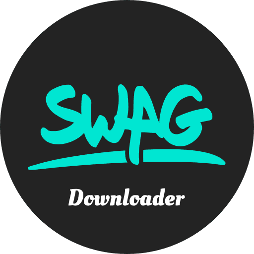
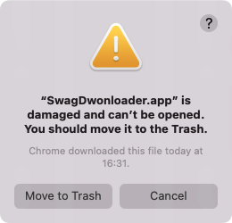
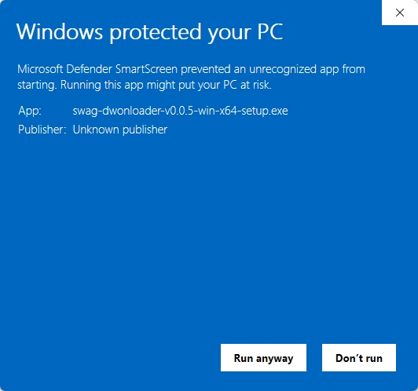

<div align=center>

</div>

# Swag.live Downloader

[](https://choosealicense.com/licenses/mit/)
[](./zReadme/zh-tw.md)

這是一個 [swag.live](https://swag.live) 網站的視頻下載器, 請注意本項目只能下載你在 `swag` 上已經購買的視頻，詳情查看: [swag.live archive](https://swag.live/archive?lang=en)


> 需要注意的是，本項目只適合個人學習使用，請遵守相關協議。


> 演示視頻地址: [點擊我查看在線演示](https://www.dropbox.com/scl/fi/beb96ny2jmptsnq1n0y10/demo.mp4?rlkey=pdw0e9stgyl75wlbkbvf8qvn2&e=1&st=44mpr8ao&dl=0)

## 安裝

你可以前往 [Release](xxx) 頁面下載對應系統的安裝包，如果沒有找到對應的安裝包則說明目前暫不支持。

### Mac OS

在下載完成並安裝之後，如果你是mac的包版本系統 (> Big sur) 則會提示你如下信息:



這是因為該項目為學習項目, 所以並沒有簽署相關蘋果秘鑰，解決這個問題也很簡單，你只需要執行如下指令

```shell
sudo spctl --master-disable # and need set 'Anywhere' in https://discussions.apple.com/thread/255759797?sortBy=rank
sudo xattr -d com.apple.quarantine /Applications/SwagDownloader.app
```

### Windows

在下載完成之後，你可以點擊 `setup.exe` 進行安裝，同樣的你可能會遇到類似以下截圖的內容



這是因為該項目為學習項目, 所以並沒有簽署相關證書, 所以你必須點擊 `Run anyway` 才可以執行。

## 登錄帳號

你可以選擇兩種方式登錄你的 `swag.live` 帳號, 並用來獲取你已經購買的視頻

### 直接登錄 (推薦)

如果你信任本項目，你可以點擊 `Activate Your Account` 按鈕並且使用帳號或者密碼進行登錄

### 使用Token

如果你比較擔心，那麼你可以使用源站的 `token` 進行激活, 詳細步驟如下:

**step-1**. 請使用 `Chome`, `Firefox`, `Edge` 等瀏覽器前往 [swag.live login](https://swag.live/?lang=en) 並登錄

**step-2**. 當你登錄成功之後，請使用`F12`打開你的瀏覽器調試工具並選擇 `console` 選項

**step-3**. 你可以使用如下代碼嘗試提取你的Token

```javascript
var db
var request = indexedDB.open('localforage', 3)
request.onsuccess = function () {
  db = request.result
  var tx = db.transaction('keyvaluepairs', 'readonly')
  var store = tx.objectStore('keyvaluepairs')
  var _request = store.getAll('_refreshToken')
  _request.onsuccess = function () {
    var token = _request.result.toString()
    console.log(token)
  }
}
```

或者

```javascript
var db
var request = indexedDB.open('localforage', 2)
request.onsuccess = function () {
  db = request.result
  var tx = db.transaction('keyvaluepairs', 'readonly')
  var store = tx.objectStore('keyvaluepairs')
  var _request = store.getAll('_refreshToken')
  _request.onsuccess = function () {
    var token = _request.result.toString()
    console.log(token)
  }
}
```

**step-4**. 將 `_refreshToken` 粘貼到 `Use Token` 輸入框中點擊 `Activate` 按鈕激活你的帳號

## issue

如果你有任何問題可以發布相關的 **issue** 並提供下載日誌詳情

## Thanks

[Electron-Vite](https://electron-vite.org/)

[FFmpeg](https://ffmpeg.org/)

[N_m3u8dl-RE](https://github.com/nilaoda/N_m3u8DL-RE)

## Sponsor

<a href="https://www.buymeacoffee.com/SwagDownloader" target="_blank"></a>
